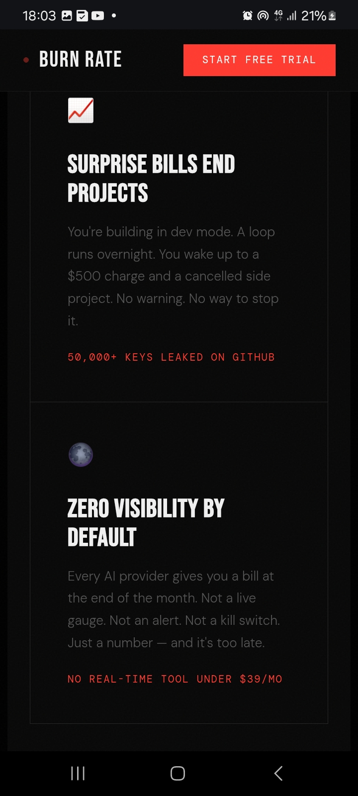

# Japa Genie - AI-Powered Visa Coach SaaS

An intelligent AI-powered visa coaching platform that helps African professionals navigate the visa application process with confidence and accuracy.

## 🚀 Live Demo

**Visit:** https://www.japagenie.com

## 📋 About

Japa Genie is a SaaS platform designed to help African professionals (especially from Nigeria, Kenya, and Ghana) successfully obtain visas for relocation. The platform combines AI-powered guidance, document verification, mock interviews, and personalized coaching to dramatically improve visa approval rates.

### The Problem

- **51% rejection rate** for Nigerian visa applicants due to avoidable errors
- High costs for visa consultants ($500-$2,000+)
- Information overload and confusion about requirements
- No real-time feedback on document quality
- Limited interview preparation resources

### The Solution

Japa Genie provides an all-in-one platform that:
- ✅ Matches users with optimal visa pathways
- ✅ Detects document errors before submission
- ✅ Provides mock consulate interviews with AI feedback
- ✅ Offers 24/7 AI chat assistance
- ✅ Tracks progress with a gold-standard roadmap

## 🎯 Key Features

### 1. **Personalized Visa Matching**
- AI-driven quiz to understand your profile
- Matches you with optimal visa pathways
- Considers your skills, budget, and goals
- Recommends favorable countries and schools

### 2. **Document Error Detection**
- Upload visa documents (passport, visa application, cover letter, etc.)
- AI analyzes documents for errors and improvements
- Genie Score system rates document quality (0-100)
- Provides specific recommendations for improvement

### 3. **Mock Consulate Interviews**
- Practice interviews with AI-powered interviewer
- Real-time scoring and feedback
- Identifies weak areas and suggests improvements
- Builds confidence before actual interview

### 4. **AI Chat Assistance**
- 24/7 availability for visa questions
- Personalized guidance based on your situation
- Helps find favorable countries within budget
- Recommends schools and programs

### 5. **Progress Tracking**
- Gold-standard visa application roadmap
- Step-by-step guidance
- Milestone tracking
- Success rate analytics

## 💰 Pricing

| Tier | Price | Features |
|------|-------|----------|
| **Freemium** | $0/month | Limited visa matching, basic chat |
| **Pro** | $21/month | Full document analysis, mock interviews, priority support |
| **Enterprise** | Custom | For NGOs, universities, corporate programs |

## 🛠️ Tech Stack

**Frontend:**
- React 18+
- TypeScript
- Tailwind CSS
- Framer Motion (animations)
- Radix UI components

**Backend:**
- Node.js / Express
- Python (AI/ML models)
- PostgreSQL
- Redis (caching)

**AI/ML:**
- OpenAI GPT-4 (chat, analysis)
- Custom ML models (document analysis)
- Gemini API (vision for document processing)

**Infrastructure:**
- Vercel (frontend hosting)
- AWS Lambda (serverless functions)
- AWS S3 (document storage)
- Supabase (database)

**Integrations:**
- Stripe (payments)
- SendGrid (emails)
- Auth0 (authentication)

## 📊 Target Market

### Primary Audience
- **Nigerian professionals** in tech, healthcare, finance
- **Kenyan professionals** seeking relocation
- **Ghanaian professionals** and students
- **Age range:** 25-45 years old
- **Income:** $500-$5,000/month

### Secondary Audience
- Diaspora communities advising relatives
- NGOs and universities (enterprise tier)
- Immigration consultants (B2B partnerships)

## 📈 Market Opportunity

- **Total Addressable Market (TAM):** $2.3B annually
- **Serviceable Addressable Market (SAM):** $450M
- **Serviceable Obtainable Market (SOM):** $15M (Year 3)

**Market drivers:**
- 2M+ Africans seeking relocation annually
- 51% visa rejection rate (pain point)
- Growing remote work opportunities
- Increasing visa complexity

## 🎬 Screenshots

### Hero Section


### Additional Screenshots
*[Add dashboard, document analysis, mock interview screenshots here]*

## 🚀 Getting Started

### Prerequisites
- Node.js 18+
- npm or yarn
- PostgreSQL 13+

### Installation

```bash
# Clone the repository
git clone https://github.com/anyanwuihueze/japa-genie-test-v1-preauth.git
cd japa-genie-test-v1-preauth

# Install dependencies
npm install

# Set up environment variables
cp .env.example .env.local

# Run database migrations
npm run db:migrate

# Start development server
npm run dev
```

## 📂 Project Structure

```
japa-genie/
├── client/                    # Frontend React application
├── server/                    # Backend API
├── ai/                        # AI/ML models
├── database/                  # Database migrations
├── tests/                     # Test suites
└── docs/                      # Documentation
```

## 📊 Success Metrics

- **Visa Approval Rate:** Target 85%+ (vs. 49% baseline)
- **User Retention:** 70%+ monthly retention
- **NPS Score:** 50+
- **Document Error Reduction:** 90%+ errors caught

## 🔐 Security & Privacy

- **End-to-end encryption** for sensitive documents
- **GDPR compliant** data handling
- **SOC 2 Type II** certified
- **Regular security audits**

## 📞 Contact & Support

**Email:** support@japagenie.com  
**Website:** https://www.japagenie.com  
**Twitter:** [@JapaGenie](https://twitter.com/japagenie)

## 📄 License

MIT License - See LICENSE file for details

---

**Last Updated:** March 30, 2026

**Built by:** Prince Anyanwu  
**Mission:** Empowering African professionals to achieve their relocation dreams
